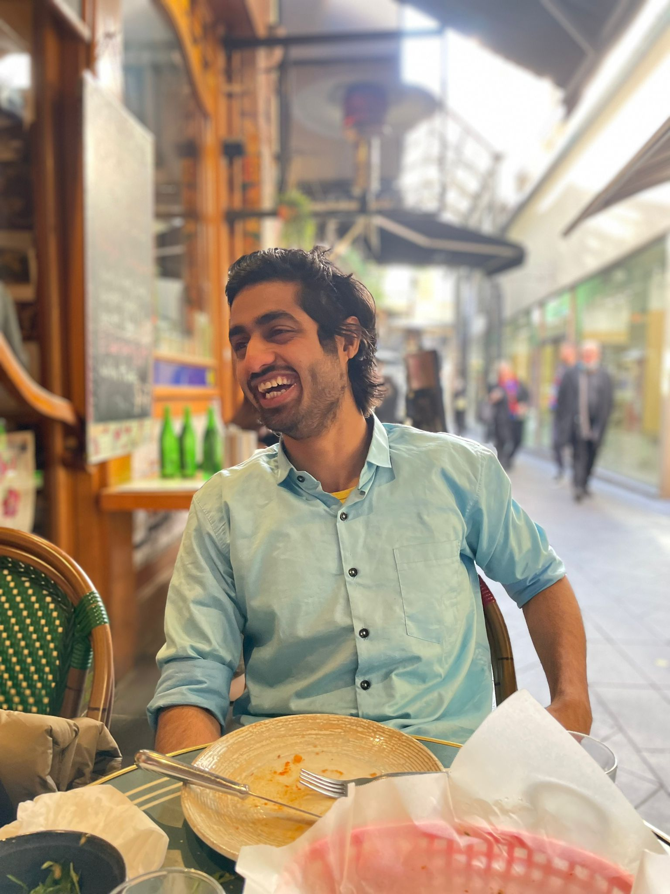

# Welcome to My Portfolio!

  

Hello there! 👋 Welcome to my personal portfolio hosted on GitHub Pages. Here, you'll find a comprehensive collection of my work, achievements, blogs, and experiences. Feel free to explore and get to know more about me and my journey.

## About Me

I'm Pranav, a passionate and dedicated individual with a strong background in tech. I thrive on challenges, enjoy problem-solving, and love to learn new things. This portfolio is a reflection of my journey so far, showcasing my technical accomplishments and sharing my insights through blogs.

## Portfolio Sections

### 1. Blogs

I believe in the power of sharing knowledge. In the [Blogs](https://pranavbarve125.github.io/blogs/) section, you'll find a collection of articles I've written on various topics. From tutorials to insights, I aim to contribute to the community and help others learn from my experiences.

### 2. Work Experiences

My journey wouldn't be complete without the various [Work Experiences](https://pranavbarve125.github.io/#experience) I've had. I've had the privilege to work with incredible teams on exciting projects, each contributing to my growth and understanding of the industry.

### 3. Get to Know Me

For a more personal touch, check out the [About Me](https://pranavbarve125.github.io/#about) page. Learn about my interests, hobbies, and the philosophy that drives me forward. Let's connect and share our experiences!

## Let's Connect

I'm always excited to connect with fellow enthusiasts, learners, and professionals. Whether you have questions, suggestions, or just want to have a chat, feel free to reach out to me on [Gmail](mailto:pranavbarve98@gmail.com). You can also connect with me on [LinkedIn](https://www.linkedin.com/in/pranav-barve/) for more professional interactions.

Thank you for visiting my portfolio. I hope you enjoy exploring my work and getting to know more about me. Here's to learning, growing, and connecting!

Best regards,

Pranav Barve
[My Portfolio](https://pranavbarve125.github.io/)
